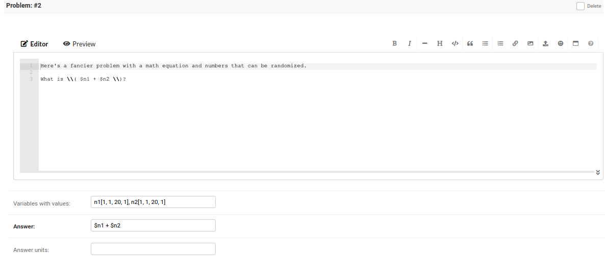
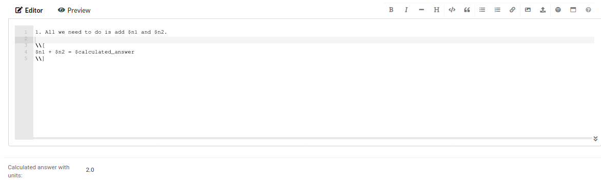

# KGI STEAM
The name is a combination of an abbreviation for Kogakuin 
(the school where I used to work) and the 
acronym [STEAM](https://en.wikipedia.org/wiki/STEAM_fields).

The vast majority of the code was written off-the-cuff during meetings
and so this certainly wasn't intended to be robust piece of
software by any means. It's far from perfect, but it was at least good enough 
to help manage my workload.

## Table of Contents
* [Features](#Features)
    * [Making a Worksheet](#Making-a-Worksheet)
        * [Problem field](#Problem-field)
        * [Variables with values field](#Variables-with-values-field)
        * [Answer field](#Answer-field)
        * [Answer units field](#Answer-units-field)
        * [Solution field](#Solution-field)
        * [Calculated answer with units](#Calculated-answer-with-units)
* [Installation Notes](#Installation-Notes)
* [Demo Site](#Demo-Site)
* [Tech Stack](#Tech-Stack)

## Features
The site is designed to allow students to practice solving problems. It
requires no login, so students don't have to remember another set of login 
credentials.

### For students
* Try a problem and check it instantly.
* Randomize the numbers in your problems and try again.

### For teachers
* Use the syllabus to remind students what's going on in class.
* Worksheets allow you to render mathematical equations on the web.
* Resources allow students to quickly navigate to any external links you may need for class.

#### Making a Worksheet

##### Problem field
The first field is the problem field. In addition to standard markdown you
can add inline LaTeX enclosing your LaTeX in \\\\(  \\\\). You can also add
variable to your problem by prefixing your variable names with a dollar sign.

* Valid variable names: `$var1`, `$var_car`, `$m_electron`

##### Variables with values field
allows you to specify the values of your variables. **You shouldn't prefix 
variable names with '$' in this field.** The variables should be separated 
by commas and can each take up to four arguments.

* `variable_name[default_value, minimum, maximum, is_int=0]`
* `is_int` should be either 0 or 1.
*  If only `default_value` is specified, then the problem will not be 
   randomizable.

##### Answer field
A mathematical expression used to calculate the answer to each problem. 

##### Answer units field
An optional field used to display the units for the answer.

##### Solution Field
This field works the same way as the problem field with one additional feature.
By default the variable `$calculated_answer` can be used to retrieve the value
from the calculated answer field.

##### Calculated answer with units
The result of evaluating the expression in the **answer field**. If units were
specified they will be displayed alongside the value.

## Installation Notes
1. Create a python virtual environment.
2. From within your virtual env run `pip install -r requirements.txt`
3. Try running `manage.py runserver`, if that doesn't work follow the
   instructions printed in the error message and setup a .env_settings file.
4. Apply the migrations `manage.py migrate`.

## Demo Site
The GitHub contains a database called `demo.sqlite3`. The database contains
an example course with a syllabus, worksheet, and several resources.

### Demo Site Admin
* Username: test.testington
* password: not-password

## Tech Stack
*  [Python Anywhere](https://www.pythonanywhere.com/)
*  [Django 3.0](https://docs.djangoproject.com/en/3.0/)
*  [Bulma CSS](https://bulma.io/)

### Shoutouts to...
*   [MathJax](https://www.mathjax.org/)
    for rendering my math equations.

*   [Martor](https://github.com/agusmakmun/django-markdown-editor)
    for creating an awesome interface to preview and edit markdown
    (and for pulling my commits).

*   [Icons8](https://icons8.com/) 
    for inspiring the logo and providing the base SVG files.

*   [Real Favicon Generator](https://realfavicongenerator.net/)
    for generating the favicons, 

*   [Unsplash](https://unsplash.com/search/photos/open-source)
    for providing the images for the courses.
